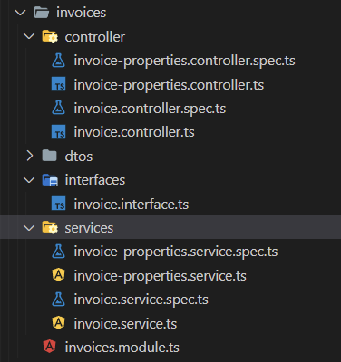

## Basic Structure

در بالاترین سطح دو دایرکتوری src , test قرار دارد

دایرکتوری test برای e2e testing

دایرکتوری src سورس های پروژه


## SRC Structure

<b>application</b> : ماژول های برنامه در آن قرار میگیرد

<b>infrastructure</b> : سرویس ها و ماژول هایی که بصورت کلی قابل استفاده هستند قرار میگیرند

<b>wrappers</b> : رپرهای برنامه قرار میگیرد


## application Structure
<h3>ساختار application</h1>

بصورت کلی ساختار دایروکتوری ها در این بخش به این صورت میباشد :

<b>
section / feature / services, controllers, dtos,unit tests, interfaces, ....

for example :
```
vpc/ vm/ createVm.controller.ts, createVm.service.ts,....

```
نمونه :



</b>

<h5>
در ماژول core

سرویس ها و کنترلر های پایه وعمومی نظیر فاکتور ، تسک ها ، تیکتینگ و ... قرار میگیرد

</h5>


<h2>نکته مهم : رعایت ساختار ماژولار در این بخش میباشد<h2>

<h3>مانند تصویر نمونه ، بطور مثال در ماژول invoice 
باید تمامی کنترلر ها و سرویس ها و اینترفیس ها و یونیت تست ها و انتیتی ها ( درصورت وجود)  مرتبط با invoice قرار بگیرد
</h3>

## infrastructure Structure
<h3>
در این قسمت کدهای پایه و عمومی مانند میدلویرها ، انتیتی های عمومی ، کانفیگ های برنامه ، فیلترها ، پایپ ها ، بخش های مربوط به اتنتیکیشن و اتوریزیشن و.... قرار میگیرد
</h3>

<h4>

<b>configs</b> : کانفیگ های برنامه نظیر دیتابیس ها ، سرویس ها و ... قرار میگیرد

<b>helpers</b> : سرویس های خارجی مورد استفاده نظیر سرویس های otp generator , email service , sms service ,... 
</h4>

## wrappers Structure


